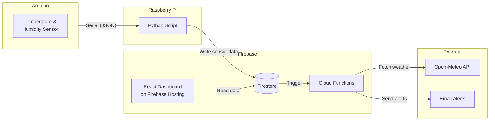

# humidity-sensor

A home humidity monitoring system that correlates indoor humidity measurements with local precipitation data. Built to track whether a water leak repair was effective by monitoring humidity levels in the affected area over time.

## Architecture



## Components

### Arduino (`arduino/`)
Reads humidity and temperature from a DHT-22 (AM2302) sensor and outputs JSON over serial every 5 seconds:
```json
{"status":"OK","humidity":50.90,"temperature":22.00}
```

### Raspberry Pi (`raspberrypi/`)
Python script that reads sensor data from the Arduino via serial connection and posts it to Firestore every 15 minutes.

```bash
# Install dependencies
pip install -r requirements.txt

# Run
python process_data.py <serial_port> <firebase_config_path>
# Example: python process_data.py ttyACM0 path/to/firebase_config.json
```

#### Development sync
A helper script `sync_file.sh` uses `fswatch` and `rsync` to automatically sync code changes to your Raspberry Pi during development.

```bash
# Configure your Raspberry Pi connection
cp .env.example .env
# Edit .env with your username and paths

# Run the sync watcher (requires fswatch: brew install fswatch)
./sync_file.sh
```

### Firebase Functions (`firebase/functions/`)
Two Cloud Functions triggered when new sensor readings are created:
- **fetchWeatherConditions**: Fetches current weather data from the Open-Meteo API and stores it in Firestore
- **sendHumidityAlert**: Sends email alerts when humidity exceeds a configurable threshold (default: 70%)

```bash
# Configure your location for weather data
cp .env.example .env.local
# Edit .env.local with your latitude/longitude
```

### Dashboard (`dashboard/`)
React dashboard built with Vite and Tailwind CSS that displays:
- Current sensor readings (humidity, temperature)
- Current weather conditions
- Historical chart correlating indoor humidity with precipitation

```bash
cd dashboard
npm install
npm run dev      # Development server
npm run deploy   # Build and deploy to Firebase Hosting
```

## Sources

### Reading DHT-22 sensor data with an Arduino

* [DHT-22 sensor setup](https://www.instructables.com/How-to-use-DHT-22-sensor-Arduino-Tutorial/)
* [Arduino sensor libraries](https://www.arduino.cc/reference/en/libraries/category/sensors/)
* [AM2302-Sensor library (the only one with decent documentation)](https://github.com/hasenradball/AM2302-Sensor)

### Sending email alerts with Firebase Functions

* [Trigger Email extension usage](https://invertase.io/blog/send-email-extension)

Email recipients for alerts are configured in Firestore:
- Collection: `notification_recipients`
- Document: `email`
- Field: `recipients` (array of email addresses)

```json
{
  "recipients": [
    "test-1@email.com",
    "test-2@email.com"
  ]
}
```
